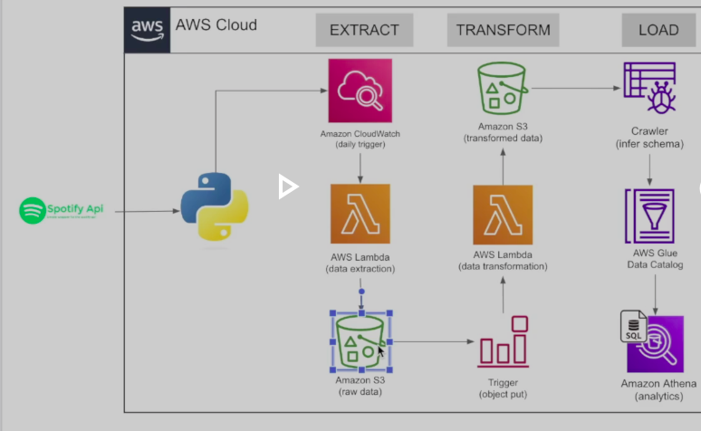

:star: Star us on GitHub — it motivates us a lot to code !!
### Author : _Vikas Kumar_

##  :beginner: Project Description 
Design and implement a sample data pipeline data engineering project using Spotify
## Project Objectives 
This Data pipeline project performs the following task:

 <br/>

Integrating with Spotify API and extracting Data<br/>
Deploying code on AWS Lambda for Data Extraction<br/>
Adding trigger to run the extraction automatically<br/>
Writing transformation function <br/>
Building automated trigger on transformation function<br/>
Store files on S3 properly<br/>
Building Analytics Tables on data files using Glue and Athena<br/>
 
### :notebook: Prerequistes:

Python - Version 3.12.3 is used [click here](https://www.python.org/downloads/)<br/>
AWS Account [click here](https://aws.amazon.com/)<br/>
Developer Spotify Account [click here](https://developer.spotify.com/)<br/>

###  :zap: Approach: 


### :electric_plug: Environment Set Up: 


###  :file_folder: Project Structure
The API test framework project structure as below 

```

```

##  :lock: License
Add a license here, or a link to it.
